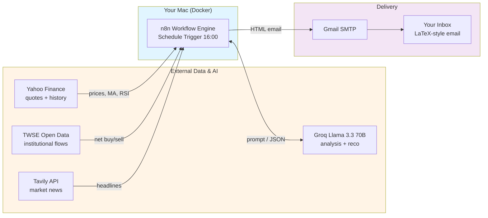
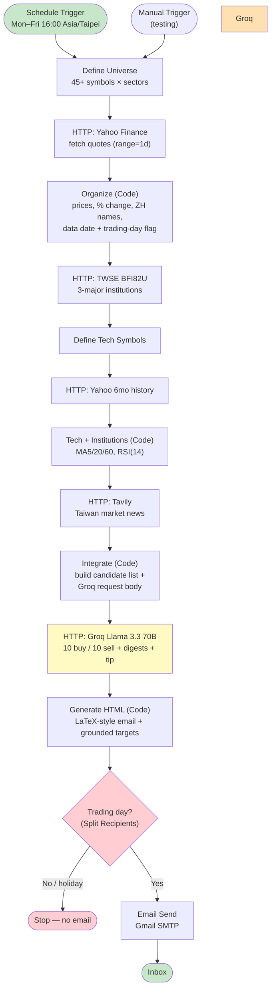

# n8n Taiwan Stock Push (Brian 股票推播)

An end-to-end automation system that emails a clean, LaTeX-styled **daily Taiwan-stock briefing** after every market close, built on the **n8n** workflow engine and self-hosted on **Docker**. It aggregates live quotes, institutional flows, technical indicators, and market news, then uses **Groq Llama 3.3 70B** to generate diversified buy/sell recommendations, per-stock rationale, news digests, and a daily finance-term tip — delivered via **Gmail SMTP**.

> Note: The workflow JSON uses Chinese node names (e.g. `整理分類行情`, `整合資料`, `生成雜誌風 HTML`). The Code expressions reference these exact names via `$('整理分類行情')`. If you rename nodes after import, update the references accordingly.

---

## Features

- **Daily AI briefing, trading days only**: Runs every weekday at 16:00 (Asia/Taipei) after the 13:30 close. A trading-day gate derived from the index's last trade timestamp automatically skips weekends and national holidays — no email is sent on non-trading days.

- **Broad, diversified stock universe**: Tracks 45+ Taiwan stocks across 20+ sectors (semiconductors, electronics, financials, plastics, steel, shipping, airlines, textiles, food, telecom, biotech, retail, autos, construction, ETFs).

- **Real data, grounded numbers**: Live quotes from **Yahoo Finance**, three-major-institution net buy/sell from the **TWSE** open data, and MA5/20/60 + RSI(14) technicals. Target/stop-loss prices are computed mechanically from the real current price (+8% / −6%) — the AI never invents price levels.

- **10 buy + 10 sell recommendations**: **Groq Llama 3.3 70B** selects diversified long/short ideas from the candidate pool (never concentrated in large-cap weights), each with a 2–3 sentence rationale that cites the stock's real same-day move and sector context.

- **Per-article news digests + daily finance term**: **Tavily** pulls recent Taiwan market news; the model writes a 2–3 sentence summary per headline and explains one finance/investment term per day (e.g. P/E ratio, dividend yield, moving average, RSI) with a worked numeric example.

- **Clean LaTeX-style email**: Serif typography, Roman-numeral sections, and hairline rules produce a typeset, mobile-friendly HTML email — no emoji, no heavy boxes.

- **Privacy-first & free**: Runs entirely on your own machine via Docker. The LLM is Groq's free tier (100,000 tokens/day is far above the ~6,000 tokens a single daily run uses). No paid cloud workflow service.

---

## Architecture

### System Overview



### Daily Pipeline



---

## Data Sources

| Source | Purpose | Cost |
|---|---|---|
| Yahoo Finance Chart API | Real-time quotes + 6-month history (MA/RSI) | Free, no key |
| TWSE Open Data (`BFI82U`) | Three-major-institution net buy/sell | Free, no key |
| Tavily API | Recent Taiwan market news | Free tier (1,000/mo) |
| Groq (`llama-3.3-70b-versatile`) | Recommendations, summaries, daily tip | Free tier (100k tokens/day) |
| Gmail SMTP | Email delivery | Free (Gmail app password) |

---

## Email Layout

```
Brian 股票推播                      ← title + date (no dark boxes)
────────────────────────────────
I.   今日買進建議    10 diversified buys: price, same-day %,
                     2–3 sentence rationale, target / stop / confidence
II.  今日賣出建議    10 diversified sell / reduce ideas
III. 市場新聞        headline + AI 2–3 sentence digest + link
IV.  每日投資小知識   one finance term explained with a numeric example
────────────────────────────────
disclaimer · 投資請自負風險 (red) · 黃柏郡 Po-Chun Huang
```

---

## Setup

### Prerequisites

- Docker Desktop
- A Groq API key (free) — https://console.groq.com
- A Tavily API key (free) — https://tavily.com
- A Gmail account with an App Password (requires 2-Step Verification)

### 1. Start n8n

Copy `docker-compose.example.yml` to `docker-compose.yml`, then create an `.env` next to it (see `.env.example`):

```
GROQ_API_KEY=gsk_xxx
TAVILY_API_KEY=tvly-xxx
```

```bash
docker compose up -d
# open http://localhost:5678
```

The compose file sets `N8N_BLOCK_ENV_ACCESS_IN_NODE=false` so Code/HTTP nodes can read `$env.GROQ_API_KEY` and `$env.TAVILY_API_KEY`.

### 2. Create the Gmail SMTP credential

In n8n → Credentials → new **SMTP**:

| Field | Value |
|---|---|
| Host | `smtp.gmail.com` |
| Port | `465` |
| SSL/TLS | on |
| User | your Gmail address |
| Password | your Gmail **App Password** |

Name it **Gmail SMTP**.

### 3. Import the workflow

Import `workflows/brian-stock-push.json`. Open the **Email Send** node and:

- Select your **Gmail SMTP** credential.
- Replace `YOUR_EMAIL@gmail.com` (sender + recipient) with your address. Add more recipients in the **Split Recipients** Code node if desired.

### 4. Run it

- Click **Test workflow** (the Manual Trigger) to send immediately, or set the workflow **Active** to run on schedule.
- To force a send on a non-trading day for testing, run with the environment variable `FORCE_SEND=1` (the Split Recipients gate honors it).

---

## Scheduling & Trading-Day Logic

- The **Schedule Trigger** uses cron `0 16 * * 1-5` (weekdays 16:00, Asia/Taipei).
- The **Organize** node reads the index's `regularMarketTime`, converts it to a Taipei date (fixed UTC+8), and sets `isTradingDay = (data date === today)`. On weekends and national holidays the market never traded "today", so the flag is false.
- The **Split Recipients** node returns an empty list when `isTradingDay` is false (unless `FORCE_SEND=1`), so the Email node simply does not run — you only ever receive a briefing on actual trading days.

---

## Customization

- **Stock universe**: edit the list in the **Define Universe** node and the matching `UNIVERSE` array (symbol → name → sector) in the **Organize** node.
- **Send time**: change the cron in the Schedule Trigger.
- **Recipients**: edit the array in the **Split Recipients** node.
- **Number of ideas / tone**: edit the system prompt in the **Integrate** node (currently 10 buys + 10 sells, diversified across sectors).

---

## Troubleshooting

| Issue | Solution |
|---|---|
| Groq `429 ... tokens per day (TPD): Limit 100000` | Free daily token budget exhausted (usually from rapid testing). One daily run uses ~6,000 tokens; the limit resets daily. Space out manual tests or upgrade the Groq tier. |
| Email "No recipients defined" | The `toEmail` / `subject` / `bccEmail` fields must be expressions — they start with `=` (e.g. `={{ $json.toEmail }}`). |
| Institutional flows look wrong (foreign = 0) | The TWSE label `外資及陸資(不含外資自營商)` contains `自營商`; parse with `startsWith`, not `includes`. |
| No email on a weekday | Check whether it was a national holiday (market closed → trading-day gate skips it), and that the index quote returned a same-day timestamp. |
| Category shows `2330.TW` instead of 台積電 | A symbol is missing from the `UNIVERSE` name map in the Organize node. |

---

## License

Apache License 2.0 — see [LICENSE](LICENSE).
