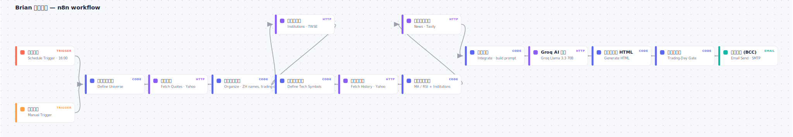
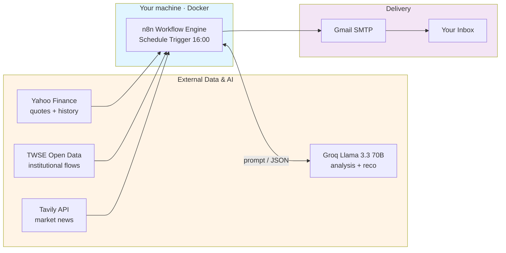

# n8n Taiwan Stock Push (Brian 股票推播)

An end-to-end automation that emails a **daily Taiwan-stock briefing** after every market close, built on the **n8n** workflow engine and self-hosted on **Docker** (Mac / Windows / Linux). It pulls live quotes, institutional flows, technicals, and news, then uses **Groq Llama 3.3 70B** to produce 10 buy + 10 sell diversified recommendations, per-stock rationale, news digests, and a daily finance term — delivered via **Gmail SMTP**.

> Note: The workflow JSON uses Chinese node names (e.g. `整理分類行情`, `整合資料`). The Code expressions reference these exact names via `$('整理分類行情')`. If you rename nodes after import, update the references too.

---

## Features

- **Trading days only** — runs weekdays 16:00 (Asia/Taipei) after the 13:30 close; a trading-day gate derived from the index timestamp skips weekends and national holidays automatically.
- **45+ stocks, 20+ sectors** — semiconductors, electronics, financials, plastics, steel, shipping, airlines, textiles, food, telecom, biotech, retail, autos, construction, ETFs.
- **Real data, grounded numbers** — Yahoo Finance quotes, TWSE institutional net buy/sell, MA5/20/60 + RSI(14). Target / stop-loss are computed from the real price (+8% / -6%); the AI never invents price levels.
- **10 buy + 10 sell recommendations** — Groq Llama 3.3 70B picks diversified ideas (never concentrated in large caps), each with a 2-3 sentence rationale citing the stock's same-day move.
- **News digests + daily finance term** — Tavily headlines summarized per article, plus one finance term explained with a numeric example each day.

---

## Architecture

### Workflow Canvas



### System Overview



---

## Data Sources

| Source | Purpose | Cost |
|---|---|---|
| Yahoo Finance Chart API | Real-time quotes + 6-month history | Free, no key |
| TWSE Open Data (`BFI82U`) | Three-major-institution net buy/sell | Free, no key |
| Tavily API | Recent Taiwan market news | Free tier |
| Groq (`llama-3.3-70b-versatile`) | Recommendations, summaries, daily tip | Free tier |
| Gmail SMTP | Email delivery | Free (App Password) |

---

## Setup

Works on **macOS, Windows, and Linux** — anywhere Docker Desktop runs.

### Prerequisites

- Docker Desktop (macOS / Windows / Linux)
- Groq API key (free) — https://console.groq.com
- Tavily API key (free) — https://tavily.com
- Gmail App Password (requires 2-Step Verification)

### 1. Start n8n

Copy `docker-compose.example.yml` to `docker-compose.yml` and create an `.env` beside it (see `.env.example`):

```
GROQ_API_KEY=gsk_xxx
TAVILY_API_KEY=tvly-xxx
```

```bash
docker compose up -d        # then open http://localhost:5678
```

> Windows: run the same command in PowerShell or Windows Terminal after Docker Desktop is running. The compose file is cross-platform; no path changes are needed.

The compose file sets `N8N_BLOCK_ENV_ACCESS_IN_NODE=false` so nodes can read `$env.GROQ_API_KEY` and `$env.TAVILY_API_KEY`.

### 2. Gmail SMTP credential

In n8n create an **SMTP** credential named **Gmail SMTP**: host `smtp.gmail.com`, port `465`, SSL on, user = your Gmail, password = your **App Password**.

### 3. Import & run

Import `workflows/brian-stock-push.json`, open **Email Send**, select the **Gmail SMTP** credential, and replace `YOUR_EMAIL@gmail.com` with your address (sender + recipient). Click **Test workflow** to send now, or set the workflow **Active** for the daily schedule. To force a send on a non-trading day for testing, run with `FORCE_SEND=1`.

---

## Workflow Nodes

| # | Node (ZH) | Type | Role |
|---|---|---|---|
| 1 | 每日排程 / 手動測試 | Trigger | Cron `0 16 * * 1-5` (Asia/Taipei) + manual test |
| 2 | 定義分類標的 | Code | Stock universe (symbol + ZH name) |
| 3 | 抓取行情 | HTTP | Yahoo Finance quotes (`range=1d`) |
| 4 | 整理分類行情 | Code | Prices, % change, ZH names, **data date + trading-day flag** |
| 5 | 抓三大法人 | HTTP | TWSE `BFI82U` institutional flows |
| 6 | 定義技術標的 / 抓技術歷史 | Code + HTTP | 6-month history for MA/RSI |
| 7 | 算技術與法人 | Code | MA5/20/60, RSI(14), institutions (`startsWith` parse) |
| 8 | 搜尋台股新聞 | HTTP | Tavily news |
| 9 | 整合資料 | Code | Build candidate list + Groq request body |
| 10 | Groq AI 分析 | HTTP | Llama 3.3 70B → 10 buy / 10 sell + digests + tip |
| 11 | 生成雜誌風 HTML | Code | LaTeX-style HTML, **grounded targets** |
| 12 | 分割收件人 | Code | **Trading-day gate** (`FORCE_SEND=1` to override) |
| 13 | 寄送郵件 (BCC) | Email | Gmail SMTP |

The five Code nodes (the core logic) are below. They are also embedded in `workflows/brian-stock-push.json`.

<details><summary><b>定義分類標的</b> — stock universe</summary>

```javascript
// 選股池(代號 + 中文名)
const list = [
  { symbol: '^TWII', name: '台股加權' },
  { symbol: '2330.TW', name: '台積電' },
  { symbol: '2454.TW', name: '聯發科' },
  { symbol: '2303.TW', name: '聯電' },
  { symbol: '3711.TW', name: '日月光投控' },
  { symbol: '2379.TW', name: '瑞昱' },
  { symbol: '2317.TW', name: '鴻海' },
  { symbol: '2382.TW', name: '廣達' },
  { symbol: '2357.TW', name: '華碩' },
  { symbol: '3231.TW', name: '緯創' },
  { symbol: '4938.TW', name: '和碩' },
  { symbol: '2308.TW', name: '台達電' },
  { symbol: '3008.TW', name: '大立光' },
  { symbol: '2327.TW', name: '國巨' },
  { symbol: '2881.TW', name: '富邦金' },
  { symbol: '2882.TW', name: '國泰金' },
  { symbol: '2891.TW', name: '中信金' },
  { symbol: '2886.TW', name: '兆豐金' },
  { symbol: '2884.TW', name: '玉山金' },
  { symbol: '1301.TW', name: '台塑' },
  { symbol: '1303.TW', name: '南亞' },
  { symbol: '6505.TW', name: '台塑化' },
  { symbol: '2002.TW', name: '中鋼' },
  { symbol: '1101.TW', name: '台泥' },
  { symbol: '1102.TW', name: '亞泥' },
  { symbol: '2603.TW', name: '長榮' },
  { symbol: '2609.TW', name: '陽明' },
  { symbol: '2615.TW', name: '萬海' },
  { symbol: '2610.TW', name: '華航' },
  { symbol: '2618.TW', name: '長榮航' },
  { symbol: '1402.TW', name: '遠東新' },
  { symbol: '1476.TW', name: '儒鴻' },
  { symbol: '1216.TW', name: '統一' },
  { symbol: '2412.TW', name: '中華電' },
  { symbol: '3045.TW', name: '台灣大' },
  { symbol: '4904.TW', name: '遠傳' },
  { symbol: '6446.TW', name: '藥華藥' },
  { symbol: '1795.TW', name: '美時' },
  { symbol: '2912.TW', name: '統一超' },
  { symbol: '2707.TW', name: '晶華' },
  { symbol: '2207.TW', name: '和泰車' },
  { symbol: '9921.TW', name: '巨大' },
  { symbol: '2542.TW', name: '興富發' },
  { symbol: '0050.TW', name: '元大台灣50' },
  { symbol: '0056.TW', name: '元大高股息' },
  { symbol: '00878.TW', name: '國泰永續高股息' },
];
return list.map(x => ({ json: x }));
```
</details>

<details><summary><b>整理分類行情</b> — quotes, ZH names, trading-day detection</summary>

```javascript
// 整理行情 + 中文名 + 正確資料日期/交易日判斷
const UNIVERSE = [
  { s: '^TWII', n: '台股加權', c: '指數' },
  { s: '2330.TW', n: '台積電', c: '半導體' },
  { s: '2454.TW', n: '聯發科', c: '半導體' },
  { s: '2303.TW', n: '聯電', c: '半導體' },
  { s: '3711.TW', n: '日月光投控', c: '半導體' },
  { s: '2379.TW', n: '瑞昱', c: '半導體' },
  { s: '2317.TW', n: '鴻海', c: '電子' },
  { s: '2382.TW', n: '廣達', c: '電子' },
  { s: '2357.TW', n: '華碩', c: '電子' },
  { s: '3231.TW', n: '緯創', c: '電子' },
  { s: '4938.TW', n: '和碩', c: '電子' },
  { s: '2308.TW', n: '台達電', c: '電子' },
  { s: '3008.TW', n: '大立光', c: '光學' },
  { s: '2327.TW', n: '國巨', c: '被動元件' },
  { s: '2881.TW', n: '富邦金', c: '金融' },
  { s: '2882.TW', n: '國泰金', c: '金融' },
  { s: '2891.TW', n: '中信金', c: '金融' },
  { s: '2886.TW', n: '兆豐金', c: '金融' },
  { s: '2884.TW', n: '玉山金', c: '金融' },
  { s: '1301.TW', n: '台塑', c: '塑化' },
  { s: '1303.TW', n: '南亞', c: '塑化' },
  { s: '6505.TW', n: '台塑化', c: '塑化' },
  { s: '2002.TW', n: '中鋼', c: '鋼鐵' },
  { s: '1101.TW', n: '台泥', c: '水泥' },
  { s: '1102.TW', n: '亞泥', c: '水泥' },
  { s: '2603.TW', n: '長榮', c: '航運' },
  { s: '2609.TW', n: '陽明', c: '航運' },
  { s: '2615.TW', n: '萬海', c: '航運' },
  { s: '2610.TW', n: '華航', c: '航空' },
  { s: '2618.TW', n: '長榮航', c: '航空' },
  { s: '1402.TW', n: '遠東新', c: '紡織' },
  { s: '1476.TW', n: '儒鴻', c: '紡織' },
  { s: '1216.TW', n: '統一', c: '食品' },
  { s: '2412.TW', n: '中華電', c: '電信' },
  { s: '3045.TW', n: '台灣大', c: '電信' },
  { s: '4904.TW', n: '遠傳', c: '電信' },
  { s: '6446.TW', n: '藥華藥', c: '生技' },
  { s: '1795.TW', n: '美時', c: '生技' },
  { s: '2912.TW', n: '統一超', c: '零售' },
  { s: '2707.TW', n: '晶華', c: '觀光' },
  { s: '2207.TW', n: '和泰車', c: '汽車' },
  { s: '9921.TW', n: '巨大', c: '自行車' },
  { s: '2542.TW', n: '興富發', c: '營建' },
  { s: '0050.TW', n: '元大台灣50', c: 'ETF' },
  { s: '0056.TW', n: '元大高股息', c: 'ETF' },
  { s: '00878.TW', n: '國泰永續高股息', c: 'ETF' },
];
const nameMap = {}, categoryMap = {}, categories = {};
UNIVERSE.forEach(u => { nameMap[u.s] = u.n; categoryMap[u.s] = u.c; if (!categories[u.c]) categories[u.c] = []; });

const items = $input.all();
const marketData = [];
let lastMarketTime = 0;

for (const item of items) {
  try {
    const result = item.json.chart.result[0];
    const meta = result.meta;
    const symbol = meta.symbol;
    const price = meta.regularMarketPrice || 0;
    const prevClose = meta.chartPreviousClose !== undefined ? meta.chartPreviousClose :
                      meta.previousClose !== undefined ? meta.previousClose : price;
    const pct = prevClose > 0 ? ((price - prevClose) / prevClose * 100) : 0;
    if (meta.regularMarketTime && meta.regularMarketTime > lastMarketTime) lastMarketTime = meta.regularMarketTime;
    const data = {
      symbol,
      name: nameMap[symbol] || symbol,
      price: Number(price.toFixed(2)),
      prevClose: Number(prevClose.toFixed(2)),
      pct: Number(pct.toFixed(2)),
      change: Number((price - prevClose).toFixed(2)),
      volume: meta.regularMarketVolume || 0,
      category: categoryMap[symbol] || '其他'
    };
    marketData.push(data);
    if (categories[data.category]) categories[data.category].push(data);
  } catch (e) {}
}

const categoryStats = {};
Object.entries(categories).forEach(([cat, list]) => {
  if (list.length > 0) {
    const avgPct = list.reduce((s, i) => s + i.pct, 0) / list.length;
    categoryStats[cat] = {
      avgPct: Number(avgPct.toFixed(2)),
      upCount: list.filter(i => i.pct > 0).length,
      totalCount: list.length,
      items: list.sort((a, b) => b.pct - a.pct)
    };
  }
});

const ymd = (ms) => {
  const d = new Date(ms + 8 * 3600 * 1000);
  return d.getUTCFullYear() + '-' + String(d.getUTCMonth() + 1).padStart(2, '0') + '-' + String(d.getUTCDate()).padStart(2, '0');
};
let dataDate, displayDate, isTradingDay = false;
if (lastMarketTime) {
  dataDate = ymd(lastMarketTime * 1000);
  displayDate = dataDate.replace(/-/g, '/');
  isTradingDay = (dataDate === ymd(Date.now()));
} else {
  dataDate = ymd(Date.now());
  displayDate = dataDate.replace(/-/g, '/');
}

return [{ json: { marketData, categories, categoryStats, isTradingDay, dataDate, displayDate } }];
```
</details>

<details><summary><b>整合資料</b> — candidate list + Groq prompt</summary>

```javascript
const market = $('整理分類行情').first().json;
const marketData = market.marketData || [];
const categoryStats = market.categoryStats || {};
const tf = (() => { try { return $('算技術與法人').first().json; } catch (e) { return { tech: [], fac: null }; } })();

const tickerOf = (sym) => String(sym).replace(/\.TWO?$/, '').replace('^', '');

// 候選股(排除指數，且必須有真實現價)
const candidates = marketData
  .filter(m => !String(m.symbol).startsWith('^') && m.price > 0)
  .map(m => ({ ticker: tickerOf(m.symbol), name: m.name, price: m.price, pct: m.pct, category: m.category }));

const candText = candidates
  .map(c => `${c.ticker} ${c.name}｜現價 ${c.price}｜當日 ${c.pct >= 0 ? '+' : ''}${c.pct}%｜${c.category}`)
  .join('\n');

const techText = (tf.tech || []).map(t => {
  const bull = Number(t.ma5) > Number(t.ma20) && Number(t.ma20) > Number(t.ma60);
  return `${tickerOf(t.name)}｜MA5 ${t.ma5}／MA20 ${t.ma20}／MA60 ${t.ma60}｜RSI ${Number(t.rsi).toFixed(0)}｜${bull ? '多頭排列' : '均線糾結/偏弱'}`;
}).join('\n') || '無';

const facText = tf.fac
  ? `外資 ${tf.fac.foreign} 億、投信 ${tf.fac.trust} 億、自營商 ${tf.fac.dealer} 億、合計 ${tf.fac.total} 億`
  : '暫無';

const catText = Object.entries(categoryStats)
  .map(([c, s]) => `${c} 平均 ${s.avgPct}%（上漲 ${s.upCount}/${s.totalCount}）`).join('\n');

const total = marketData.length;
const up = marketData.filter(m => m.pct > 0).length;
const down = marketData.filter(m => m.pct < 0).length;
const flat = marketData.filter(m => m.pct === 0).length;

const newsDetails = [];
for (const it of $('搜尋台股新聞').all()) {
  for (const r of (it.json.results || []).slice(0, 8)) {
    if (r && r.title) newsDetails.push({ title: r.title, url: r.url });
  }
}
const topNews = newsDetails.slice(0, 6);

const systemPrompt = `你是專業的台股分析師。你只能從「候選股清單」中挑選推薦標的（嚴禁挑清單以外的股票），且不要自行猜測目標價或停損價（系統會依真實現價計算）。輸出繁體中文 JSON：
{
 "market_summary":"一句話總結今日盤勢（40字內，需呼應上漲/下跌家數）",
 "buy_recommendations":[{"ticker":"2330","name":"台積電","reason":"詳細的買進依據，需涵蓋：該股當日漲跌表現、所屬產業題材或基本面、以及技術面/法人動向，寫成完整 2-3 句、約 60-90 字","confidence":"高/中/低"}],
 "sell_recommendations":[{"ticker":"2317","name":"鴻海","reason":"詳細的減碼依據，需涵蓋：當日弱勢表現、產業面利空或轉弱訊號、技術面風險，寫成完整 2-3 句、約 60-90 字"}],
 "news_digest":["第1則新聞2-3句客觀摘要","..."],
 "investment_tip":{"concept":"一個財金或投資名詞（每天換一個，例：本益比、殖利率、移動平均線、RSI、停損、護城河、複利、ETF 折溢價）","detail":"用白話解釋這個名詞的意思與用途，並帶一個含數字的簡單例子（90字內）"},
 "one_liner":"一句話操作總結（30字內）"
}
規則：buy 給 10 檔、sell 給 10 檔，務必分散在不同產業(半導體、電子、金融、塑化、鋼鐵、航運、航空、紡織、食品、電信、生技、觀光、汽車、營建、ETF 等)，不要全部集中在台積電等大型權值股，盡量納入中小型與傳產股，買進與賣出標的不可重複；ticker 與 name 必須和候選股清單完全一致；每檔的 reason 都要寫詳細(完整 2-3 句、約 60-90 字)，引用清單中的真實數字（當日漲跌%）並結合產業題材與技術面，不可只寫一句話；news_digest 長度與順序需對應提供的新聞；market_summary 與 one_liner 請用「全面／多數／普遍」等詞描述漲跌廣度，不要寫出任何「N 檔」之類的追蹤檔數數字；只輸出 JSON。`;

const userPrompt = `【今日盤勢廣度】\n上漲 ${up} 檔、下跌 ${down} 檔、平盤 ${flat} 檔（供你判斷，回覆時請勿直接寫出總檔數）\n\n【類股表現】\n${catText}\n\n【候選股清單（只能從這裡挑選推薦）】\n${candText}\n\n【技術面】\n${techText}\n\n【三大法人（全市場合計）】\n${facText}\n\n【今日新聞（請依序產生 news_digest）】\n${topNews.map((n, i) => `${i + 1}. ${n.title}`).join('\n')}`;

return [{
  json: {
    newsDetails: topNews,
    candidates,
    requestBody: {
      model: 'llama-3.3-70b-versatile',
      temperature: 0.4,
      max_tokens: 3500,
      response_format: { type: 'json_object' },
      messages: [
        { role: 'system', content: systemPrompt },
        { role: 'user', content: userPrompt },
      ],
    }
  }
}];
```
</details>

<details><summary><b>生成雜誌風 HTML</b> — LaTeX-style email + grounded targets</summary>

```javascript
const md = $('整理分類行情').first().json;
const marketData = md.marketData || [];

const newsDetails = (() => { try { return $('整合資料').first().json.newsDetails || []; } catch (e) { return []; } })();
const resp = $input.first().json;
let ai = {};
try { ai = JSON.parse(resp.choices[0].message.content); } catch (e) { ai = {}; }

const today = md.displayDate || new Date().toLocaleDateString('zh-TW', { timeZone: 'Asia/Taipei', year: 'numeric', month: '2-digit', day: '2-digit' });
const esc = (s) => String(s == null ? '' : s).replace(/&/g, '&amp;').replace(/</g, '&lt;').replace(/>/g, '&gt;');

const up = '#c0392b', down = '#1f8b4c', ink = '#1a1a1a', sub = '#444444', faint = '#8a8a8a', rule = '#dcdcdc';
const SERIF = "Georgia,'Times New Roman','Songti TC','Noto Serif TC','Source Han Serif TC',serif";
const pcol = (p) => p > 0 ? up : p < 0 ? down : faint;
const ptxt = (p) => (p > 0 ? '+' : '') + Number(p).toFixed(2) + '%';
const roundPx = (v) => v < 50 ? Number(v.toFixed(2)) : v < 500 ? Number(v.toFixed(1)) : Math.round(v);
const fmt = (v) => Number(v).toLocaleString();

const priceMap = {};
marketData.forEach(m => { priceMap[String(m.symbol).replace(/\.TWO?$/, '').replace('^', '')] = m; });
const lookup = (t) => priceMap[String(t)] || priceMap[String(t).replace(/\D/g, '')] || null;

const sec = (n, t) => `<div style="font-size:18px;font-weight:700;color:${ink};margin:34px 0 4px;font-family:${SERIF};">${n}　${t}</div>
  <div style="border-bottom:1.5px solid ${ink};margin-bottom:6px;"></div>`;

// 個股一列(買進:含目標停損;賣出:僅理由)
const stockRow = (idx, r, buy) => {
  const m = lookup(r.ticker);
  const px = m ? m.price : null;
  const priceTxt = m ? `現價 ${fmt(px)}（<span style="color:${pcol(m.pct)};">${ptxt(m.pct)}</span>）` : '';
  let tail = '';
  if (buy && px != null) {
    tail = `<span style="color:${faint};">｜ 目標 <span style="color:${up};">${fmt(roundPx(px * 1.08))}</span>／停損 <span style="color:${down};">${fmt(roundPx(px * 0.94))}</span>／把握度 ${esc(r.confidence || '中')}</span>`;
  }
  return `<div style="padding:13px 2px;border-bottom:1px solid ${rule};">
    <div style="font-size:16px;color:${ink};line-height:1.55;font-family:${SERIF};">
      <span style="color:${faint};">${idx}.</span> <b>${esc(r.name)}</b> <span style="color:${faint};font-size:13px;">${esc(r.ticker)}</span>　${priceTxt}
    </div>
    <div style="font-size:13px;color:${sub};line-height:1.8;margin-top:5px;font-family:${SERIF};">${esc(r.reason || '')}　${tail}</div>
  </div>`;
};

let html = `<!DOCTYPE html><html lang="zh-TW"><head><meta charset="UTF-8"><meta name="viewport" content="width=device-width,initial-scale=1"><title>Brian 股票推播</title></head>
<body style="margin:0;padding:0;background:#eeeeee;">
<div style="max-width:640px;margin:0 auto;background:#ffffff;padding:34px 26px 30px;font-family:${SERIF};color:${ink};">

<div style="text-align:center;padding:2px 0 16px;border-bottom:2.5px solid ${ink};margin-bottom:6px;">
  <div style="font-size:28px;font-weight:700;letter-spacing:1px;color:${ink};">Brian 股票推播</div>
  <div style="font-size:13px;color:${sub};margin-top:8px;letter-spacing:1px;">${today}　台股盤後速報</div>
</div>`;

// 買進
const buys = (ai.buy_recommendations || []).slice(0, 10);
html += sec('I', '今日買進建議');
if (buys.length) {
  buys.forEach((b, i) => { html += stockRow(i + 1, b, true); });
  html += `<div style="font-size:11px;color:${faint};margin:8px 0 0;line-height:1.7;">＊目標／停損為依當日現價之機械試算（+8%／−6%），僅供參考，非投資建議。</div>`;
} else {
  html += `<div style="font-size:14px;color:${sub};padding:12px 0;">今日暫無明確買進標的。</div>`;
}

// 賣出
const sells = (ai.sell_recommendations || []).slice(0, 10);
html += sec('II', '今日賣出建議');
if (sells.length) {
  sells.forEach((s, i) => { html += stockRow(i + 1, s, false); });
} else {
  html += `<div style="font-size:14px;color:${sub};padding:12px 0;">今日暫無明確賣出標的。</div>`;
}

// 市場新聞
const digest = ai.news_digest || [];
if (newsDetails.length) {
  html += sec('III', '市場新聞');
  newsDetails.slice(0, 5).forEach((n, i) => {
    const summary = digest[i] || '';
    html += `<div style="padding:13px 2px;border-bottom:1px solid ${rule};">
      <div style="font-size:15px;font-weight:700;color:${ink};line-height:1.55;">${esc(n.title)}</div>
      ${summary ? `<div style="font-size:13px;color:${sub};line-height:1.8;margin-top:5px;">${esc(summary)}</div>` : ''}
      <a href="${esc(n.url)}" style="display:inline-block;margin-top:7px;font-size:12px;color:#5a6f8c;text-decoration:underline;">閱讀全文</a>
    </div>`;
  });
}

// 投資小知識(財金名詞)
const tip = ai.investment_tip || (ai.investment_tips ? { concept: '投資小知識', detail: ai.investment_tips } : null);
if (tip) {
  html += sec('IV', '每日投資小知識');
  html += `<div style="padding:6px 2px 2px;">
    ${tip.concept ? `<div style="font-size:16px;font-weight:700;color:${ink};margin-bottom:6px;">${esc(tip.concept)}</div>` : ''}
    <div style="font-size:14px;color:${sub};line-height:2.0;">${esc(tip.detail || '')}</div>
  </div>`;
}

html += `<div style="text-align:center;margin-top:38px;padding-top:18px;border-top:1px solid ${rule};">
  <div style="font-size:12px;color:${faint};line-height:1.9;">本電子報於每個交易日盤後自動寄送，內容僅供參考，<br/><span style="color:${up};font-weight:700;">投資請自負風險</span>。</div>
  <div style="font-size:13px;color:${ink};font-weight:700;letter-spacing:3px;margin-top:14px;">黃柏郡　Po-Chun Huang</div>
</div>

</div></body></html>`;

return [{ json: { html, subject: 'Brian 股票推播' } }];
```
</details>

<details><summary><b>分割收件人</b> — trading-day gate</summary>

```javascript
// 只有交易日才寄(非交易日 / 休市日回傳空陣列，寄信節點就不會執行)
// 手動測試可用環境變數 FORCE_SEND=1 強制寄送(正式排程不設此變數，不受影響)
const isTradingDay = (() => { try { return $('整理分類行情').first().json.isTradingDay; } catch (e) { return true; } })();
const force = (() => { try { return $env.FORCE_SEND === '1'; } catch (e) { return false; } })();
if (!isTradingDay && !force) {
  return [];
}

const recipients = ['a08284700711@gmail.com'];
const html = $input.first().json.html;
const subject = $input.first().json.subject;
return recipients.map(to => ({
  json: { html, subject, toEmail: to, bccEmails: recipients.filter(r => r !== to) }
}));
```
</details>

---

## Scheduling & Trading-Day Logic

- Schedule Trigger cron: `0 16 * * 1-5` (weekdays 16:00, Asia/Taipei).
- `整理分類行情` reads the index `regularMarketTime`, converts to a Taipei date (fixed UTC+8), and sets `isTradingDay = (data date === today)`. On weekends/holidays the market never traded "today" → flag is false.
- `分割收件人` returns an empty list when `isTradingDay` is false (unless `FORCE_SEND=1`), so the Email node does not run. You only receive a briefing on real trading days.

---

## Customization

- **Universe** — edit `定義分類標的` and the matching `UNIVERSE` array (symbol → name → sector) in `整理分類行情`.
- **Send time** — change the Schedule Trigger cron.
- **Recipients** — edit the array in `分割收件人`.
- **Number of ideas / tone** — edit the system prompt in `整合資料`.

---

## Troubleshooting

| Issue | Solution |
|---|---|
| Groq `429 ... tokens per day (TPD): Limit 100000` | Free daily token budget exhausted (usually rapid testing). One daily run uses ~6,000 tokens; resets daily. |
| Email "No recipients defined" | `toEmail` / `subject` / `bccEmail` must be expressions starting with `=` (e.g. `={{ $json.toEmail }}`). |
| Institutional foreign = 0 | The TWSE label `外資及陸資(不含外資自營商)` contains `自營商`; parse with `startsWith`, not `includes`. |
| Category shows `2330.TW` not 台積電 | A symbol is missing from the `UNIVERSE` name map in `整理分類行情`. |

---

## License

Apache License 2.0 — see [LICENSE](LICENSE).
